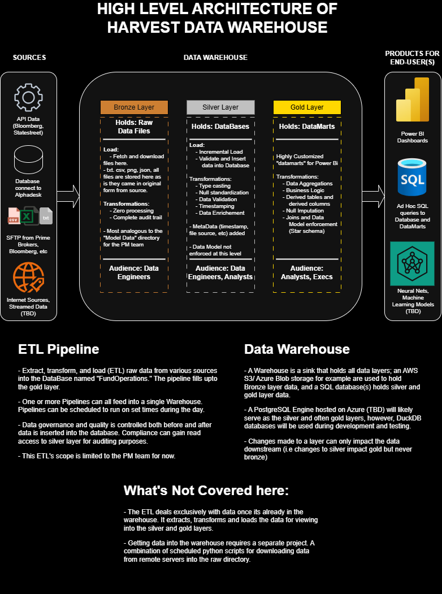

# FundOperations data Pipeline

Extract, Transform, Load (ETL). This pipeline collects data from various sources and inserts them into Harvest's FundOperations Database.
The Database enforces strict datatype casting, and validates entries before insertion.

---
## Data Architecture

The data architecture for this project follows the medallion architecture framework: **Bronze**, **Silver**, **Gold** layers:


1. **Bronze Layer**: Holds source data in raw form. Meant to show data as it came from source. Holds full history.
2. **Silver Layer**: Takes data from bronze layer, cleans, transforms, and validates the entries and before inserting into silver layer database. schema is enforced here.
3. **Gold Layer**: Serves as a highly aggregated view of Silver layer. Different tables serve different reporting needs. Data for analysis only.

---
## Prerequisites
- Python 3.10+
- 8GB RAM recommended
- Knowledge of basic git commands

## Installation

### Clone and Setup
```bash
# Clone repo
git clone https://github.com/mmoin3/data-pipeline.git

# Set up virtual environment
python -m venv myvenv
```

### Activate Virtual Environment

<details>
<summary><b>macOS/Linux</b></summary>

```bash
source myvenv/bin/activate
```
</details>

<details>
<summary><b>Windows PowerShell</b></summary>

```powershell
& .\myvenv\Scripts\Activate.ps1
```
</details>

### Install Dependencies

```bash
pip install -r requirements.txt
```

### Environment Setup

```bash
# Set up environment (create .env with your database credentials)
# cp .env.example .env  # if .env.example exists
# for mft login, paste the client.key, and client.crt credentials in the .\certs folder
```

### Optional: Bloomberg API Setup

> **Note:** `blpapi` (Bloomberg API) must be installed separately as it's proprietary software and not available via pip. This is required only to use Bloomberg Tools.

```powershell
python -m pip install --index-url=https://blpapi.bloomberg.com/repository/releases/python/simple/ blpapi
```

This is required to use the `BloombergClient` for data extraction via BDH and BDP functions.

## Bloomberg Tools (Simple)

```python
from src.services.bloomberg_client import BloombergClient

with BloombergClient() as client:
    hist = client.BDH(["XIU CN Equity"], ["PX_LAST"], "20260101", "20260220","WEEKLY")
    snap = client.BDP(["XIU CN Equity"], ["PX_LAST", "VOLUME"])
```

---
## Documentation & Standards
The config.py file in the root directory is the source of truth for the entire project. Unique values are rarely hardcoded in individual scripts.

For detailed project conventions, naming standards, data architecture specifications, and development practices, see the [`docs/`](docs/) directory:

- [**conventions.md**](docs/conventions.md) — Python code conventions, database naming standards, table/column structure, metadata columns
- Other documentation as applicable

Refer to these documents for contributions and architectural decisions.